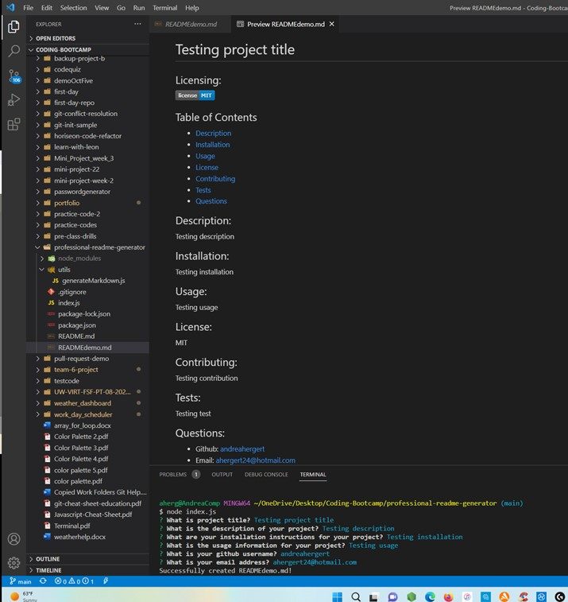

# Professional README Generator

## Licensing:

## Table of Contents 
- [Description](#description)
- [Installation](#installation)
- [Usage](#usage)
- [License](#license)
- [Contributing](#contributing)
- [Tests](#tests)
- [Questions](#questions)

## Description:
This is a professional README generator created in the UW Coding Bootcamp that should save a user time with starting a readme file.  This generator will produce a READMEdemo.md file.  After initial generation, you may change the name of the file to README.md and make any updates in the file.

## Installation:
- Download it through Github
- Ensure inquirer is installed

## Usage:
- Open terminal and navigate to correct folder
- Type 'node index.js'
- Answer the prompts that follow
- On success a READMEdemo.md will be generated.
- After initial generation, you may change the name of the file to README.md and make any updates in the file.

Screenshot:

Link to Video of Walkthrough for Demonstration:

https://youtu.be/0uYN0Zq7q9s

## License:
MIT

## Contributing:
There was already a starter code provided for this project here: https://github.com/coding-boot-camp/potential-enigma (which is why your see contributors listed in the repo).

Contributions are welcome through forking my repository.

## Tests:
To test locally on your computer:
- Download it through Github
- Ensure inquirer is installed
- Open terminal and navigate to correct folder
- Type 'node index.js'
- Answer the prompts that follow
- On success a READMEdemo.md will be generated.
- After initial generation, you may change the name of the file to README.md and make any updates in the file.

## Questions:
- Github: [andreahergert](https://github.com/andreahergert)
- Email: ahergert24@hotmail.com 